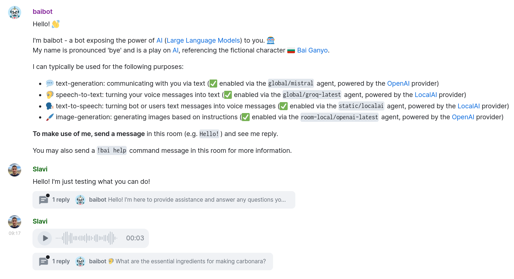

	
	<h1 align="center">baibot</h1>

🤖 baibot is an [AI](https://en.wikipedia.org/wiki/Artificial_intelligence) ([Large Language Model](https://en.wikipedia.org/wiki/Large_language_model)) bot for [Matrix](https://matrix.org/) built by [etke.cc](https://etke.cc/) (managed Matrix servers).

The name is pronounced 'bye' and is a play on [AI](https://en.wikipedia.org/wiki/Artificial_intelligence), referencing the fictional character [🇧🇬 Bai Ganyo](https://en.wikipedia.org/wiki/Bay_Ganyo).

It's designed as a more private and [featureful](#-features) alternative to [matrix-chatgpt-bot](https://github.com/matrixgpt/matrix-chatgpt-bot).
It's influenced by [chaz](https://github.com/arcuru/chaz), but does **not** use the [AIChat](https://github.com/sigoden/aichat) CLI tool and instead does everything in-process, without forking.

## 🌟 Features

- 🎨 Encourages **[provider](./docs/providers.md) choice** ([Anthropic](./docs/providers.md#anthropic), [Groq](./docs/providers.md#groq), [LocalAI](./docs/providers.md#localai), [OpenAI](./docs/providers.md#openai) and [☁️ many more](./docs/providers.md#️-providers)) as well as **[mixing & matching models](./docs/features.md#-mixing--matching-models)**:

- Supports **different use purposes** (depending on the [☁️ provider](./docs/providers.md) & model):

  - [💬 text-generation](./docs/features.md#-text-generation): communicating with you via text
  - [🦻 speech-to-text](./docs/features.md#-speech-to-text): turning your voice messages into text
  - [🗣️ text-to-speech](./docs/features.md#️-text-to-speech): turning bot or users text messages into voice messages
  - [🖌️ image-generation](./docs/features.md#-image-generation): generating images based on instructions

- 🪄 Supports [seamless voice interaction](./docs/features.md#seamless-voice-interaction) (turning user voice messages into text, answering in text, then turning that text back into voice)

- 🦻 Supports [transcribe-only mode](./docs/features.md#transcribe-only-mode) (turning user voice messages into text, without doing text-generation)

- 🗣️ Supports [text-to-speech-only mode](./docs/features.md#text-to-speech-only-mode) (turning user text messages into voice, without doing text-generation)

- 🔒 Supports [encryption](./docs/features.md#-encryption) for Matrix communication and Account-Data-stored configuration

- ♻️ Supports [context-management](./docs/configuration/text-generation.md#️-context-management) handling on some models (automatically adjusting the message history length, etc.)

- 🛠️ Allows **customizing much of the bot's [configuration](./docs/configuration/README.md)** at runtime (using commands sent via chat)

- 👥 **Actively maintained** by the team at [etke.cc](https://etke.cc/)

## 🖼️ Screenshots

You can find more screenshots on the the [🌟 Features](./docs/features.md) and other [📚 Documentation](./docs/README.md) pages, as well as in the [docs/screenshots](./docs/screenshots) directory.

## 🚀 Getting Started

🗲 For a quick experiment, you can refer to the [🧑‍💻 development documentation](./docs/development.md) which contains information on how to build and run the bot (and its various dependency services) locally.

For a real installation, see the [🚀 Installation](./docs/installation.md) documentation which contains information on [🐋 Running in a container](./docs/installation.md#-running-in-a-container) and [🖥️️️️️ Running a binary](./docs/installation.md#-running-a-binary).

## 📚 Documentation

See the bot's [📚 documentation](./docs/README.md) for more information on how to use and configure the bot.

## 💻 Development

See the bot's [🧑‍💻 development documentation](./docs/development.md) for more information on how to develop on the bot.

## 📜 Changes

This bot evolves over time, sometimes with backward-incompatible changes.

When updating the bot, refer to [the changelog](CHANGELOG.md) to catch up with what's new.

## 🆘 Support

- Matrix room: [#baibot:etke.cc](https://matrix.to/#/#baibot:etke.cc)

- GitHub issues: [etkecc/baibot/issues](https://github.com/etkecc/baibot/issues)

- (for [etke.cc](https://etke.cc/) customers): etke.cc [support](https://etke.cc/contacts/)
