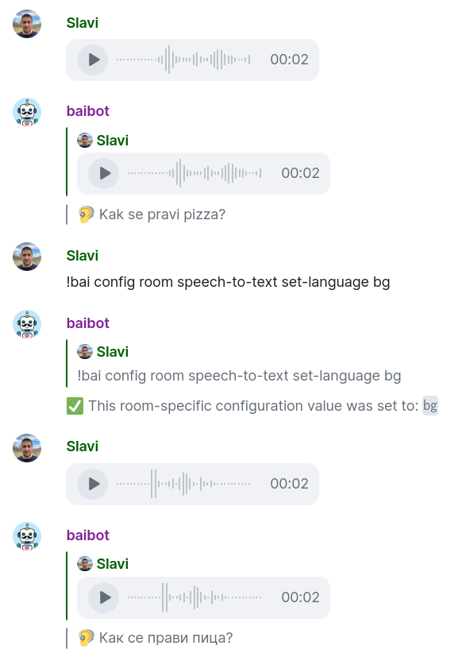

## 🦻 Speech-to-Text

Below are some configuration settings related to Speech-to-Text.

You may also wish to see:

- [🌟 Features / 🦻 Speech-to-Text](../features.md#-speech-to-text) for a higher-level introduction to the Speech-to-Text features
- [📖 Usage / 🦻 Speech-to-Text](../usage.md#-speech-to-text) section for more details on how to use the bot for Speech-to-Text in a room

### 🪄 Flow Type

Controls how voice messages sent by [👥 user](../access.md#-users) are handled.

The following configuration values are recognized:

- (default) `transcribe_and_generate_text`: the bot will turn [👥 user](../access.md#-users) voice messages into text and then generate text messages via [💬 Text Generation](../features.md#-text-generation). This is the default setting to allow for [Seamless voice interaction](../features.md#seamless-voice-interaction).

- `ignore`: the bot will ignore all audio messages

- `only_transcribe`: the bot will turn [👥 user](../access.md#-users) voice messages into text, but will **not** proceed with [💬 Text Generation](../features.md#-text-generation). Switching to this may be useful in some cases, as in [Transcribe-only mode](../features.md#transcribe-only-mode).

Example: `!bai config room speech-to-text set-flow-type ignore` (this can also be set globally, see [🛠️ Room Settings](./README.md#room-settings))

### 🔤 Language

Lets you specify the language of the input voice messages, to avoid using auto-detection.
Supplying the input language using a 2-letter code (e.g. `ja`) as per [ISO-639-1](https://en.wikipedia.org/wiki/List_of_ISO_639-1_codes) may improve accuracy & latency.

In the above example screenshot, even without a language specified, the voice was understood correctly as [Bulgarian](https://en.wikipedia.org/wiki/Bulgarian_language), but was produced in latin, not [Cyrillic](https://en.wikipedia.org/wiki/Cyrillic_script), which is wrong.

If different [👥 user](../access.md#-users) are using different languages, do not specify a language.

💡 Certain models (like [OpenAI](../providers.md#openai)'s Whisper) may perform auto-translation if you specify a language, but you're speaking another one. You may abuse this side-effect for performing voice-to-text translation, but be aware that not all models behave this way.

Example (setting it to Japanese): `!bai config room speech-to-text set-language ja` (this can also be set globally, see [🛠️ Room Settings](./README.md#room-settings))
