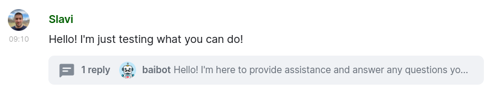
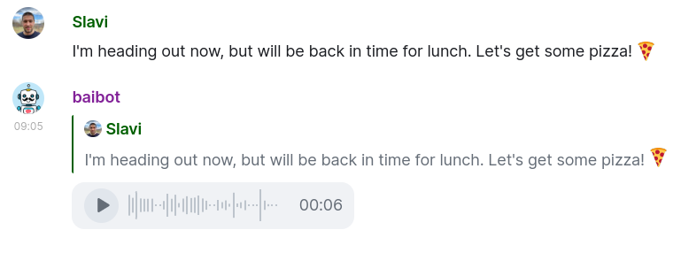
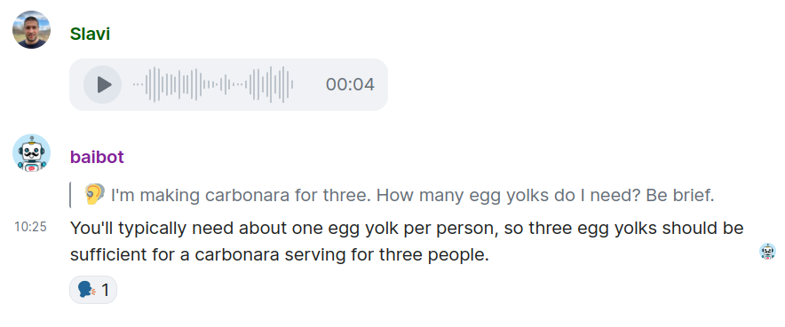
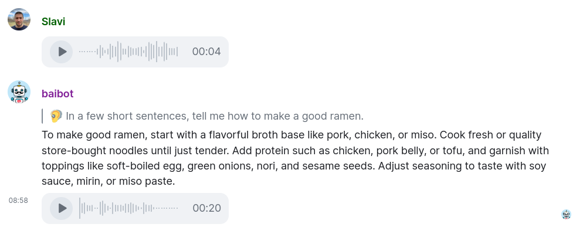
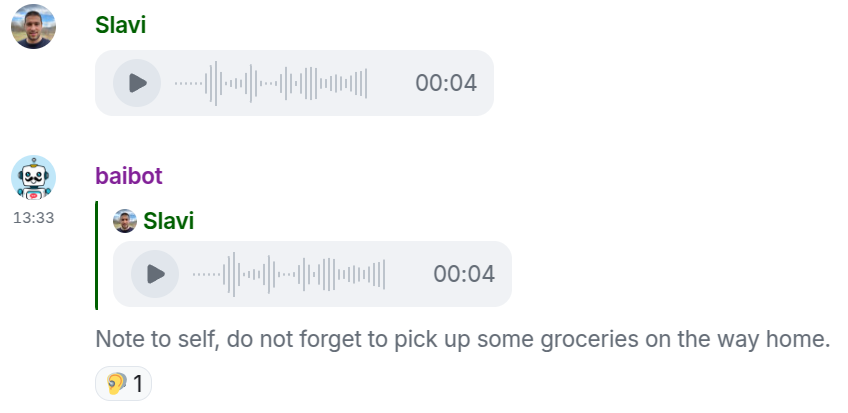

## 🌟 Features

### 🎨 Mixing & matching models

You can use **different models in different rooms** (e.g. [OpenAI](./providers.md#openai) GPT-4o alongside [Llama](https://en.wikipedia.org/wiki/Llama_(language_model)) running on [Groq](./providers.md#groq), etc.)

You can also use **different models within the same room** (e.g. [💬 text-generation](#-text-generation) handled by one [🤖 agent](./agents.md), [🦻 speech-to-text](#-speech-to-text) handled by another, [🗣️ text-to-speech](#️-text-to-speech) by a 3rd, etc.)

The bot supports the following use-purposes:

- [💬 text-generation](#-text-generation): communicating with you via text
- [🦻 speech-to-text](#-speech-to-text): turning your voice messages into text
- [🗣️ text-to-speech](#%EF%B8%8F-text-to-speech): turning bot or users text messages into voice messages
- [🖌️ image-generation](#%EF%B8%8F-image-generation): generating images based on instructions

In a given room, each different purpose can be served by a different [☁️ provider](./providers.md) and model. This combination of provider and model configuration is called an [🤖 agent](./agents.md). Each purpose can be served by a different **handler** agent.

See a [🖼️ Screenshot of an example room configuration](./screenshots/config-status-handlers.webp).

For more information about configuring handlers, see the [🤝 Handlers / Configuring](./configuration/handlers.md#configuring) documentation section.

### 💬 Text Generation

Text Generation is the bot's ability to **respond to users' text messages with text**.

In multi-user (group) rooms, to avoid disturbing the normal conversation between people, the bot is auto-configured to only respond to messages starting with the command prefix (`!bai`) or direct mentions via the [💬 Text Generation / 🗟 Prefix Requirement Type](./configuration/text-generation.md#-prefix-requirement-type) setting.

Normally, the bot only responds to allowed [👥 Users](./access.md#-users). In certain cases, it's useful for an allowed user to provoke the bot to respond even in foreign threads or reply chains. You can learn more about this feature in the [📖 Usage / 💬 Text Generation / On-demand involvement](./usage.md#on-demand-involvement) section.

A few other features (like [🗣️ Text-to-Speech](#️-text-to-speech) and [🦻 Speech-to-Text](#-speech-to-text)) combine well with Text Generation, so you **don't necessarily need to communicate with the bot via text** (with [Seamless voice interaction](#seamless-voice-interaction), you can communicate only with voice).

You may also wish to see:

- [🛠️ Configuration / 💬 Text Generation](./configuration/text-generation.md) for configuration options related to Text Generation
- [📖 Usage / 💬 Text Generation](./usage.md#-text-generation) section for more details on how to use the bot for Text Generation in a room

### 🗣️ Text-to-Speech

Text-to-Speech is the bot's ability to **turn text messages into voice messages**.

It can be performed **on the bot's own text messages** (responses to yours due to [💬 Text Generation](#-text-generation)) and/or **on your own text messages**.

Text-to-Speech can be enabled to be done automatically or on-demand (only after reacting to a message with 🗣️), and is configurable for different message types ([🪄 Bot Messages Flow Type](./configuration/README.md#-bot-messages-flow-type) vs [🪄 User Messages Flow Type](./configuration/README.md#-user-messages-flow-type)).

By default, the bot **doesn't** perform text-to-speech. It can be configured for [Seamless voice interaction](#seamless-voice-interaction), where you can **speak to the bot** (instead of typing) and then **hear its responses**.

Another use-case is to have the bot operate in [Text-to-Speech-only mode](#text-to-speech-only-mode).

You may also wish to see:

- [🛠️ Configuration / 🗣️ Text-to-Speech](./configuration/text-to-speech.md) for configuration options related to Text-to-Speech
- [📖 Usage / 🗣️ Text-to-Speech](./usage.md#-text-to-speech) section for more details on how to use the bot for Text-to-Speech in a room

#### Text-to-Speech-only mode

You may wish to have the bot **automatically turn your text messages into voice messages**, but **without** doing [💬 Text Generation](#-text-generation).

This could be useful in a room with others, where you'd like to post text messages and have people in the room consume them more easily (by listening to audio).

To allow for this use-case, you can:

- disable [💬 Text Generation](#-text-generation) (via [💬 Text Generation / 🪄 Auto Usage](./configuration/text-generation.md#-auto-usage) setting): `!bai config room text-generation set-auto-usage never`

- enable [🗣️ Text-to-Speech](#️-text-to-speech) for user messages (via [🗣️ Text-to-Speech / 🪄 User Messages Flow Type](./configuration/text-to-speech.md#-user-messages-flow-type)): `!bai config room text-to-speech set-user-msgs-flow-type always` (or `on_demand`)

### 🦻 Speech-to-Text

Speech-to-Text is the bot's ability to **turn voice messages into text**.

The default flow is shown in the screenshot above: your voice messages are transcribed to text and [💬 Text Generation](#-text-generation) is performed. By default, the bot offers [🗣️ Text-to-Speech](#️-text-to-speech) for its answers via a 🗣️ emoji. You can click it to trigger text-to-speech on-demand.

You may also configure the bot for [Seamless voice interaction](#seamless-voice-interaction) or [Transcribe-only mode](#transcribe-only-mode), etc.

You may also wish to see:

- [🛠️ Configuration / 🦻 Speech-to-Text](./configuration/speech-to-text.md) for configuration options related to Speech-to-Text
- [📖 Usage / 🦻 Speech-to-Text](./usage.md#-speech-to-text) section for more details on how to use the bot for Speech-to-Text in a room

#### Seamless voice interaction

The bot can perform seamless voice interaction (🗣️-to-🗣️), allowing you to **speak to the bot** (instead of typing) and then **hear its responses**.

The flow is like this:

1. 👤 You sending a voice message
2. 🤖 The bot:
  - (default) first turning your **voice message into text** ([🦻 Speech-to-Text](#-speech-to-text)) and posting it as a reply. This lets you  you see what the bot heard.
  - (default) then **answering in text** ([💬 Text Generation](#-text-generation)). This lets you read/skim text, if you so prefer.
  - (can be enabled) finally **turning the answer's text into a voice message** ([🗣️ Text-to-Speech](#️-text-to-speech))
3. 👤 You continuing the conversation via text or voice messages

⚠️ Certain clients (like [Element](https://element.io/)) only support sending voice messages as top-level room messages, not as thread replies. Until this client limitation is fixed, Element users can only send the 1st message as a voice message - subsequent replies in the same conversation thread will need to be sent as text messages.

By default, the last part of the aforementioned flow is **not enabled**, because we assume **a saner default is to reply with text and merely *offer* text-to-speech to those who want it**. Offering is done by the bot reacting to its own message with 🗣️, and letting you click this emoji to trigger text-to-speech on-demand.

To enable automatic text-to-speech for the bot's messages, set the [🗣️ Text-to-Speech / 🪄 Bot Messages Flow Type](./configuration/text-to-speech.md#-bot-messages-flow-type) setting to `only_for_voice` or `always` (e.g. `!bai config room text-to-speech set-bot-msgs-flow-type only_for_voice`).

#### Transcribe-only mode

If you'd like to have the bot **only turn voice messages into text** (without generating text messages or voice messages), you can configure the bot for that.

To operate in this mode, you can:

- disable [💬 Text Generation](#-text-generation) (via [💬 Text Generation / 🪄 Auto Usage](./configuration/text-generation.md#-auto-usage) setting): `!bai config room text-generation set-auto-usage never`

- adjust the [🦻 Speech-to-Text / 🪄 Flow Type](./configuration/speech-to-text.md#-flow-type) setting to make the bot only transcribe (without doing [💬 Text Generation](#-text-generation)): `!bai config room speech-to-text set-flow-type only_transcribe`

### 🖌️ Image Generation

Image generation is the bot's ability to **generate images** based on text prompts.

See a [🖼️ Screenshot of the Image Generation feature](./screenshots/image-generation.webp).

You may also wish to see:

- [🛠️ Configuration / 🖌️ Image Generation](./configuration/image-generation.md) for configuration options related to Image Generation
- [📖 Usage / 🖌️ Image Generation](./usage.md#-image-generation) section for more details on how to use the bot for Image Generation in a room
- [🫵 Sticker Generation](#-sticker-generation) - a special case of Image Generation

### 🫵 Sticker Generation

Sticker generation is the bot's ability to **generate sticker** images based on text prompts. It's a special case of [🖌️ Image Generation](#️-image-generation).

See a [🖼️ Screenshot of the Sticker Generation feature](./screenshots/sticker-generation.webp).

See [📖 Usage / 🖌️ Image Generation / Generating Stickers](./usage.md#generating-stickers) for details.

### 🔒 Encryption

#### Message exchange

The bot works in both **unencrypted and encrypted Matrix rooms**.

If configured, the bot can make use of **Matrix's Secure Storage (Recovery) feature**, so that it can restore its encryption keys even its local database gets lost.

#### Configuration

The bot also stores its [🛠️ configuration](./configuration/README.md) (both 📍 per-room and 🌐globally) in Matrix Account Data, which is **generally stored as plain-text in the server**.

To overcome this Matrix limitation, the bot can **optionally encrypt the configuration data** before storing it in Account Data. This allows for the bot to be used securely even against untrusted servers, without leaking sensitive configuration data to them.
